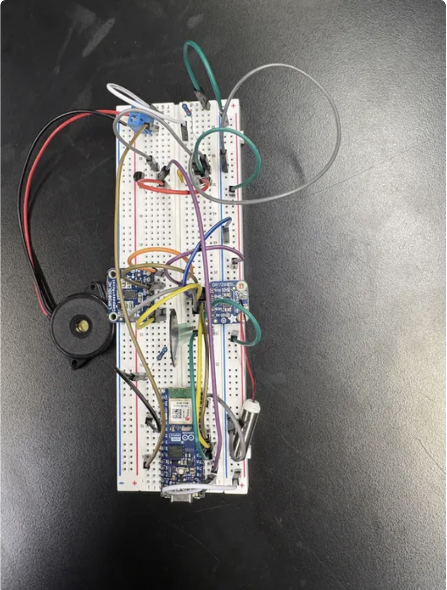
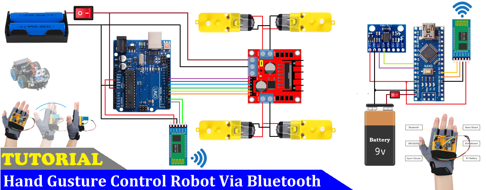

# BlueStamp Example Portfolio
This portfolio is an example set up of how the BlueStamp portfolio should be set up. The following sections will include descriptions on building the Air Quaility Monitor, Armband, Gesture Controlled Robot, Gesture Detection, Color Memory Game, Snake Game, and Floor Cleaning Robot. The project includes many achievments and issues that arised, but overall the project was enjoyable to build.

You should comment out all portions of your portfolio that you have not completed yet, as well as any instructions:
```HTML 
<!--- This is an HTML comment in Markdown -->
<!--- Anything between these symbols will not render on the published site -->
```

| **Engineer** | **School** | **Area of Interest** | **Grade** |
|:--:|:--:|:--:|:--:|
| Giselle R | Stanford University | Electrical Engineering | Incoming Junior

# Gesture Controlled Robot

**Don't forget to replace the text below with the embedding for your milestone video. Go to Youtube, click Share -> Embed, and copy and paste the code to replace what's below.**


<iframe width="560" height="315" src="https://www.youtube.com/embed/npIy5UEg34M?si=TXkRsamD7jp1G3s0" title="YouTube video player" frameborder="0" allow="accelerometer; autoplay; clipboard-write; encrypted-media; gyroscope; picture-in-picture; web-share" referrerpolicy="strict-origin-when-cross-origin" allowfullscreen></iframe>

For this Project Helpful Links include:
- Robot build: <a href="https://docs.sunfounder.com/projects/3in1-kit/en/latest/car_project/car_move_by_code.html"> Link </a>
- HC-05 Module Connection: <a href="https://docs.sunfounder.com/projects/3in1-kit/en/latest/car_project/car_move_by_code.html"> Link </a>

**Sample Code for HC-05 Connection**
```c++
#include <SoftwareSerial.h>


SoftwareSerial BTSerial(2, 3); // RX, TX


void setup() {
 Serial.begin(38400);
 BTSerial.begin(38400);   // Typical AT mode baud rate


 Serial.println("HC-05 AT Mode Test");
 Serial.println("Type AT commands below:");
}


void loop() {
 // Send Serial Monitor input to HC-05
 if (Serial.available()) {
   BTSerial.write(Serial.read());
 }


 // Send HC-05 responses to Serial Monitor
 if (BTSerial.available()) {
   Serial.write(BTSerial.read());
 }
}
```

**Hand Gesture Code**
```c++
#include <SoftwareSerial.h>
SoftwareSerial BT_Serial(2, 3); // RX, TX


#include <Wire.h>


const int MPU = 0x60; // I2C address of MPU6050 accelerometer
int16_t AcX, AcY, AcZ;


int flag=0;


void setup() {
 // put your setup code here, to run once:
Serial.begin(9600); //start serial communication at 9600bps
BT_Serial.begin(9600);


// Initalize interface to the MPU6050
Wire.begin();
Wire.beginTransmission(MPU);
Wire.write(0x6B); //DOUBLE CHECK!!!!
Wire.write(0);
Wire.endTransmission(true);


delay(500);
}


void loop() {
 // put your main code here, to run repeatedly:
Read_accelerometer(); //Read MPU6050 accelerometer


//assigns forward and backwards direction comamands
if(AcX<60 && flag==0){
 flag=1; BT_Serial.write('f');}
if(AcX>130 && flag==0){
 flag=1; BT_Serial.write('b');}


//assigns left and right direction commands
if(AcY<60 && flag==0){
 flag=1; BT_Serial.write('l');}
if(AcY>130 && flag==0){
 flag=1; BT_Serial.write('r');}


//assigns the stop command
if((AcX>70) && (AcX<120) && (AcY>70)&&(AcY<120)&&(flag==1)){
 flag=0; BT_Serial.write('s');}


delay(100);
}


void Read_accelerometer(){
 //read accelerometer data


Wire.beginTransmission(MPU);
Wire.write(0x3B); //start with register 0x3B (ACCEL_XOUT_H)
Wire.endTransmission(false);
Wire.requestFrom(MPU, 6, true); //Read 6 registers total, each axis value is stored in 2 registers


AcX = Wire.read() << 8 | Wire.read(); //X-axis value
AcY = Wire.read() << 8 | Wire.read(); //Y-axis value
AcZ = Wire.read() << 8 | Wire.read(); //Z-axis value


//Convert the accelerometer values into 0-180 deg measure
AcX = map(AcX, -1700, 1700, 0, 180);
AcY = map(AcY, -1700, 1700, 0, 180);
AcZ = map(AcZ, -1700, 1700, 0, 180);


Serial.print(AcX);
Serial.print("\t");
Serial.print(AcY);
Serial.print("\t");
Serial.println(AcZ);
}
```

**Robot Control Code**
```c++
#include <SoftwareSerial.h>
SoftwareSerial BT_Serial(2, 3); // RX, TX


#define enA 10 //Enablel L298 Pin enA
#define in1 9 //Motor1 L298 Pin in1
#define in2 8 //Motor1 L298 Pin in1
#define in3 7 //Motor2 L298 Pin in1
#define in4 6 //Motoe2 L298 Pin in1
#define enB 5 //Enable2 L298 Pin enB


char bt_data; //variable to receive data from the serial port
int Speed = 150; //Write the Duty Cycle 0 to 255 Enable Pins for Motor Speed


void setup() {
 // put your setup code here, to run once:


Serial.begin(9600); //start serial communicartiosn at 9600bps
BT_Serial.begin(9600);


pinMode(enA, OUTPUT); //declare as output for L298 Pin enA
pinMode(in1, OUTPUT); //declare as output for L298 Pin in1
pinMode(in2, OUTPUT); //declare as output for L298 Pin in2
pinMode(in3, OUTPUT); //declare as output for L298 Pin in3
pinMode(in4, OUTPUT); //declare as output for L298 Pin in4
pinMode(enB, OUTPUT); //declare as output for L298 Pin enB


delay(200);
}


void loop() {
 // put your main code here, to run repeatedly:
if(BT_Serial.available() > 0){
 //if some data is sent, reads it and saves in state
 bt_data = BT_Serial.read();
 Serial.println(bt_data);
}


if(bt_data == 'f'){ //makes DC motors move forwards
 forward(); Speed=180;}
else if(bt_data == 'b'){ //makes motors move backwards
 backward(); Speed=180;}
else if(bt_data == 'l'){ //makes motors move turn left
 turnLeft(); Speed=250;}
else if(bt_data == 'r'){ //makes motors turn right
 turnRight(); Speed=250;}
else if(bt_data == 's'){ //makes motors stop
 stop();}


analogWrite(enA, Speed); //Write The Duty Cycle 0 to 255 Enable Pin A for Motor1 Speed
analogWrite(enB, Speed); //Write The Duty Cycle 0 to 255 Enable Pin b for Motor2 Speed


delay(50);
}


void forward(){
 digitalWrite(in1, HIGH); //Right Motor forward Pin
 digitalWrite(in2, LOW); //Right Motor backward Pin
 digitalWrite(in3, LOW); //Left Motor backward Pin
 digitalWrite(in4, HIGH); //Left Motor forward Pin
}


void backward(){
 digitalWrite(in1, LOW); //Right Motor forward Pin
 digitalWrite(in2, HIGH); //Right Motor backward Pin
 digitalWrite(in3, HIGH); //Left Motor backward Pin
 digitalWrite(in4, LOW); //Left Motor forward Pin
}


void turnRight(){
 digitalWrite(in1, LOW); //Right Motor forward Pin
 digitalWrite(in2, HIGH); //Right Motor backward Pin
 digitalWrite(in3, LOW); //Left Motor backward Pin
 digitalWrite(in4, HIGH); //Left Motor forward Pin
}


void turnLeft(){
 digitalWrite(in1, HIGH); //Right Motor forward Pin
 digitalWrite(in2, LOW); //Right Motor backward Pin
 digitalWrite(in3, HIGH); //Left Motor backward Pin
 digitalWrite(in4, LOW); //Left Motor forward Pin
}


void stop(){
 digitalWrite(in1, LOW); //Right Motor forward Pin
 digitalWrite(in2, LOW); //Right Motor backward Pin
 digitalWrite(in3, LOW); //Left Motor backward Pin
 digitalWrite(in4, LOW); //Left Motor forward Pin
}

```
**Bill of Materials**
| **Part** | **Note** | **Price** | **Link** |
|:--:|:--:|:--:|:--:|
| Sun Founder | Includes the robot build parts | $59.99 | <a href="https://www.amazon.com/Arduino-A000066-ARDUINO-UNO-R3/dp/B008GRTSV6/"> Link </a> |
| Arduino Nano | MicroChip Board Control for Hand | $7.99 | <a href="https://www.amazon.com/Arduino-A000066-ARDUINO-UNO-R3/dp/B008GRTSV6/"> Link </a> |
| HC 05 Bluetooth Module | Utilized for cross communication between robot and hand | $9.99 | <a href="https://www.amazon.com/Arduino-A000066-ARDUINO-UNO-R3/dp/B008GRTSV6/"> Link </a> |
| Item Name | What the item is used for | $Price | <a href="https://www.amazon.com/Arduino-A000066-ARDUINO-UNO-R3/dp/B008GRTSV6/"> Link </a> |

# Armband

**Don't forget to replace the text below with the embedding for your milestone video. Go to Youtube, click Share -> Embed, and copy and paste the code to replace what's below.**



<iframe width="560" height="315" src="https://www.youtube.com/embed/y3VAmNlER5Y" title="YouTube video player" frameborder="0" allow="accelerometer; autoplay; clipboard-write; encrypted-media; gyroscope; picture-in-picture; web-share" allowfullscreen></iframe>

For this Project Helpful Links include:
- Robot build: <a href="https://docs.sunfounder.com/projects/3in1-kit/en/latest/car_project/car_move_by_code.html"> Link </a>
- HC-05 Module Connection: <a href="https://docs.sunfounder.com/projects/3in1-kit/en/latest/car_project/car_move_by_code.html"> Link </a>

**Bill of Materials**
| **Part** | **Note** | **Price** | **Link** |
|:--:|:--:|:--:|:--:|
| Sun Founder | Includes the robot build parts | $59.99 | <a href="https://www.amazon.com/Arduino-A000066-ARDUINO-UNO-R3/dp/B008GRTSV6/"> Link </a> |
| Arduino Nano | MicroChip Board Control for Hand | $7.99 | <a href="https://www.amazon.com/Arduino-A000066-ARDUINO-UNO-R3/dp/B008GRTSV6/"> Link </a> |
| HC 05 Bluetooth Module | Utilized for cross communication between robot and hand | $9.99 | <a href="https://www.amazon.com/Arduino-A000066-ARDUINO-UNO-R3/dp/B008GRTSV6/"> Link </a> |
| Item Name | What the item is used for | $Price | <a href="https://www.amazon.com/Arduino-A000066-ARDUINO-UNO-R3/dp/B008GRTSV6/"> Link </a> |

# First Milestone

**Don't forget to replace the text below with the embedding for your milestone video. Go to Youtube, click Share -> Embed, and copy and paste the code to replace what's below.**

<iframe width="560" height="315" src="https://www.youtube.com/embed/CaCazFBhYKs" title="YouTube video player" frameborder="0" allow="accelerometer; autoplay; clipboard-write; encrypted-media; gyroscope; picture-in-picture; web-share" allowfullscreen></iframe>

For your first milestone, describe what your project is and how you plan to build it. You can include:
- An explanation about the different components of your project and how they will all integrate together
- Technical progress you've made so far
- Challenges you're facing and solving in your future milestones
- What your plan is to complete your project

# Schematics 
Here's where you'll put images of your schematics. [Tinkercad](https://www.tinkercad.com/blog/official-guide-to-tinkercad-circuits) and [Fritzing](https://fritzing.org/learning/) are both great resoruces to create professional schematic diagrams, though BSE recommends Tinkercad becuase it can be done easily and for free in the browser. 


# Code
Here's where you'll put your code. The syntax below places it into a block of code. Follow the guide [here]([url](https://www.markdownguide.org/extended-syntax/)) to learn how to customize it to your project needs. 


# Bill of Materials
Here's where you'll list the parts in your project. To add more rows, just copy and paste the example rows below.
Don't forget to place the link of where to buy each component inside the quotation marks in the corresponding row after href =. Follow the guide [here]([url](https://www.markdownguide.org/extended-syntax/)) to learn how to customize this to your project needs. 

| **Part** | **Note** | **Price** | **Link** |
|:--:|:--:|:--:|:--:|
| Sun Founder | Includes the robot build parts | $59.99 | <a href="https://www.amazon.com/Arduino-A000066-ARDUINO-UNO-R3/dp/B008GRTSV6/"> Link </a> |
| Arduino Nano | MicroChip Board Control for Hand | $7.99 | <a href="https://www.amazon.com/Arduino-A000066-ARDUINO-UNO-R3/dp/B008GRTSV6/"> Link </a> |
| HC 05 Bluetooth Module | Utilized for cross communication between robot and hand | $9.99 | <a href="https://www.amazon.com/Arduino-A000066-ARDUINO-UNO-R3/dp/B008GRTSV6/"> Link </a> |
| Item Name | What the item is used for | $Price | <a href="https://www.amazon.com/Arduino-A000066-ARDUINO-UNO-R3/dp/B008GRTSV6/"> Link </a> |
